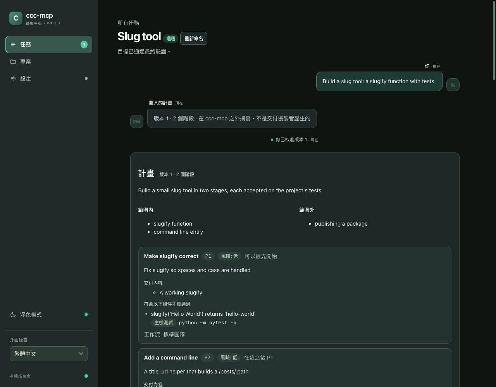
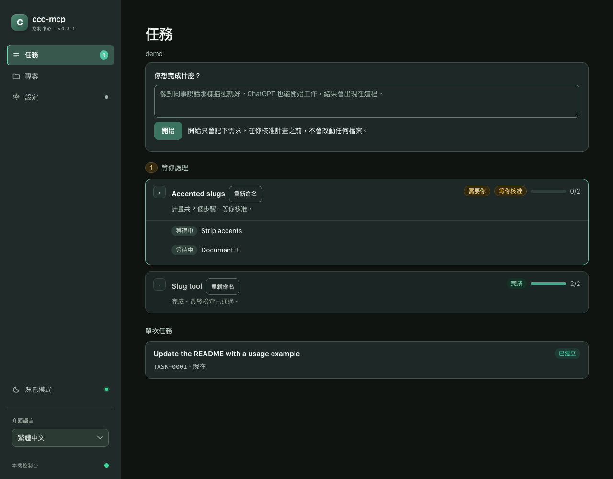

<p align="center">
  
</p>

# ccc-mcp

[English](README.md) | **繁體中文**

[](https://www.python.org/downloads/)
[](LICENSE)

### 讓 AI 專家團隊共同完善需求、分工執行、共享可追溯的工作狀態，並以證據判斷成果。

ccc-mcp 是本機的 MCP server、CLI 與 Web 控制台。它讓 ChatGPT（以及選用的 Codex 與 Claude Code）以一組分工明確的專家角色加入你的專案：分析師、設計師、審查員、開發者。需求、已核准的計畫、共用 Context、Git 修改與主機測試結果，都會保存成可追溯的工作狀態；任務是否完成，看的是主機蒐集到的證據，而不是 Agent 自己說完成了。

**舉例來說，** 你輸入「幫我做會員管理系統」。由分析師、設計師與審查員組成的工作流，可以在動手寫程式之前，把這句話整理成登入方式、角色與權限、資料模型、例外情況、驗收條件與待確認問題（[逐步說明](#能把需求想得更完整的-ai-團隊)）。那段說明是示意，不是已記錄的實測，也不保證每次都能得到完整的規格。後面有一份在小型示範專案上[真實執行過的紀錄](#一次已記錄的執行)。

**讓它與眾不同的地方：**

- **結構化的共用 Context，不是聊天摘要。** 一個專案包含多個任務，每個任務都有帶版本的已核准計畫（Approved Plan），附 SHA-256 hash 與核准紀錄。共用 Context 同樣有版本，只能透過附來源的 patch 更新。Agent 的說法、主機證據與即時的 Git 狀態分開保存。[詳細說明](#結構化共用-context)
- **能把需求想得更完整的專家團隊。** 分析師、設計師、對抗式與規格審查員、規格寫手依序接力。審查關卡會把工作退回，Meeting Mode 會先提出澄清問題，角色、順序、嚴格度與重試次數都由你決定。[詳細說明](#能把需求想得更完整的-ai-團隊)
- **先有證據。** 主機執行測試，並記錄 Git diff。「完成」以這些證據為準，而不是 AI 自己的回報。[詳細說明](#主機證據與嚴格審查)
- **從一個需求到驗證過的結果。** 需要多個步驟的工作，由交付協調者（Delivery PM）規劃階段，你核准那一版計畫，每個階段交給團隊執行，並以主機測試與有上限的修復把關。[詳細說明](#目標一個需求多個驗證過的階段)


*目前原始碼（下一版）中的任務會議室：步驟列、已儲存的對話，以及送出修正或要求指定角色重做的控制項。會議室本身在 0.4.0 就有，這張截圖是較新的設計。資料來自以腳本化 CLI 驅動的示範專案，不是真實模型。*

**用已發行的 PyPI 版本開始：**

```bash
pip install -U ccc-mcp
ccc-mcp ui
```

[快速開始](#快速開始) · [發行狀態](#發行狀態) · [文件](docs/ch/README.md)

## 功能總覽

| 能力 | 它帶給你什麼 | 狀態 |
| --- | --- | --- |
| [結構化共用 Context](#結構化共用-context) | 有版本的 Context、附 hash 的已核准計畫，以及逐項標明來源的交接包 | 0.4.0 已含 |
| [AI 專家團隊](#能把需求想得更完整的-ai-團隊) | 19 個角色、7 套內建工作流、自訂工作流、Meeting Mode、審查關卡 | 0.4.0 已含（Meeting Mode 為選用） |
| [會議室檢視](#會議室) | 每個角色的發言、執行歷程、目前卡點，以及暫停、中止、修正與重做的控制項 | 0.4.0 已含 |
| [主機證據與嚴格審查](#主機證據與嚴格審查) | 主機執行的測試、Git diff、以證據為基礎的審查關卡 | 0.4.0 已含 |
| [跨對話與跨 Agent 接續](#跨對話與跨-agent-接續) | 新的 ChatGPT 對話、接續 Prompt、額度備援 | 0.4.0 已含 |
| [目標（Goal）](#目標一個需求多個驗證過的階段) | 先規劃、核准，再依相依順序執行多個階段，搭配主機測試與有上限的修復迴圈 | 下一版 |
| [對 ChatGPT 說，在一處追蹤](#web-控制台) | 由 ChatGPT 發起工作（`start_goal`、`get_work_overview` 等），任務頁集中顯示分組的 Goal 與任務、核准與即時狀態 | 下一版 |
| [自訂角色](#能把需求想得更完整的-ai-團隊) | 在內建角色之上寫自己的指令；角色能做什麼仍由程式碼決定 | 下一版 |

## 快速開始

步驟 1–4 在已發行的 0.4.0 與目前原始碼上都適用。標示為「下一版」的功能只在原始碼中（從 clone 執行 `pip install -e .`），見[發行狀態](#發行狀態)。

1. **安裝並開啟主控台。** 安裝與啟動主控台需要用到終端機，之後大部分操作都在瀏覽器裡進行。

   ```bash
   pip install -U ccc-mcp
   ccc-mcp ui
   ```

   主控台只在 `127.0.0.1` 提供服務，啟動時會印出網址，附帶一次性的本機 token。

2. **加入專案。** 在**專案**頁建立專案或加入既有資料夾。也可以用終端機：

   ```bash
   ccc-mcp project create hello-demo --write
   ccc-mcp project add ./my-folder --write
   ```

   `--write` 會要求你在本機確認，之後允許 ccc-mcp 修改該專案並執行它的測試指令。在重要的資料夾上開啟前，請先讀[建立並授權第一個專案](docs/ch/3-first-project.md)。

3. **連接 ChatGPT。** 在 OpenAI Platform 建立 Tunnel，然後在主控台的**設定**頁連接，或執行 `ccc-mcp connect tunnel_你的ID`，並在隱藏的提示輸入 runtime API key。詳見[連接 ChatGPT](docs/ch/2-connect-chatgpt.md)。

4. **開始任務。** 在已連線的 ChatGPT 對話中描述要做的修改。若在終端機操作，`task create` 會記錄需求與驗收條件：

   ```bash
   ccc-mcp --project hello-demo task create "新增 hello 函式" --acceptance "執行後輸出 Hello"
   ```

5. **追蹤進度。** 在**任務**頁打開任務，查看會議室、成果分頁與 host 測試證據。你請 ChatGPT 做的多步驟工作會以一個群組出現在那裡。

**費用與限制，分成四個獨立部分：**

- **ChatGPT 方案。** ChatGPT-only 模式使用你現有的 ChatGPT 方案，[ChatGPT 方案本身仍有使用限制](https://learn.chatgpt.com/docs/pricing)。
- **OpenAI 模型 API。** ChatGPT-only 模式不使用計量計費的 OpenAI 模型 API 金鑰。
- **Tunnel runtime key。** Tunnel 需要在 OpenAI Platform 取得獨立的 runtime API key。它的計費依 OpenAI Platform 的條款，本專案無法決定，使用前請先確認。
- **Codex 與 Claude Code。** 這些選用工具使用各自的帳號與使用限制。

ccc-mcp 並不宣稱比單一 Agent 更省 token。工作流為了驗證而增加了幾輪，每個任務的 token 比較仍在量測中。

## 結構化共用 Context

聊天摘要只是某一個模型記得的內容。ccc-mcp 改為把工作狀態保存成結構化紀錄，每個 Agent 讀的都是同一份紀錄。

| 紀錄 | 怎麼保存 |
| --- | --- |
| **專案** | 一個已註冊的資料夾。可讀的文件放在專案內的 `.ccc-mcp/`（共用的 `CONTEXT.md`、`context/` 與各任務的報告），資料庫放在 ccc-mcp 的 home 目錄。 |
| **任務** | `TASK-0001` 等編號，記錄需求、驗收條件、狀態，以及它目前在等什麼，例如 `AGENT_RUNNING`、`USER_APPROVAL`、`PM_FLOW_DECISION`、`CHATGPT_HANDOFF_PENDING` 或 `PAUSED`。 |
| **已核准計畫（Approved Plan）** | 每份計畫有 ID、版本，以及計畫內容的 SHA-256 hash。核准紀錄寫明誰核准了哪個版本與 hash，以及核准時對應的 Context 版本。核准只適用於那一份計畫，所以較新的計畫需要重新核准。核准有兩條路徑。專案開啟讀寫授權（`--write`）時，計畫會自動核准，核准紀錄寫的是那項授權而不是某個人，所以開啟授權就等於預先核准之後的計畫。沒有授權時，由本機操作者確認確切的 hash。 |
| **共用 Context** | 有版本與歷史的快照。每次變更都以 Context Patch 送出，註明它基於哪個版本，並附上來源。 |
| **Agent 結果** | 每次執行的原始報告都原封不動保存，作為稽核軌跡。 |

**衝突與不良更新怎麼處理**

- 基於較舊 Context 版本的 Context Patch、計畫、核准或派工，會以版本衝突被拒絕。這保護的是 ccc-mcp 自己的紀錄，不會鎖住你的檔案，也不會合併在 ccc-mcp 之外所做的修改，那仍是 Git 的工作。
- 受保護的不變條件不能被移除或改寫。
- 架構相關的說法必須引用來源文件與它的 sha256，且該檔案必須仍然相符。
- 由 Agent 結果產生的 patch，必須引用該結果已保存的原始報告。
- Patch 與計畫內容會用樣式規則檢查私鑰區塊、`sk-` 與 `gh*_` 開頭的 token、bearer token，以及 `api_key`、`token`、`password`、`secret` 的賦值，符合就拒絕。這只是樣式比對：可能漏掉其他格式的憑證，也可能誤判無害的文字，所以它是安全網，不代表可以放心貼上祕密資訊。
- 語意上的變更，PM 要在看過 diff 後明確確認。ccc-mcp 無法證明兩段文字語意相同，所以只記錄這項確認，不宣稱自己檢查過。

**三種事實，不會混在一起。** 交接內容的每一行都標示為 *Agent 自述*（未驗證）、*主機證據*（由主機執行）或 *即時 Git 讀取*（剛剛執行的 `git status` 與 diff）。

**交接包裡有什麼。** `ccc-mcp task continue` 依已保存的紀錄與一次新的 Git 讀取，組成一份交接包：專案與任務、已核准計畫（含版本、hash 與核准依據）、已做出的關鍵決策、已完成事項、主機驗證狀態、剩餘工作、下一個具體動作、必要驗證方式、不可破壞的既有修改、約束，以及已知阻礙與風險。從未核准的計畫只會以中繼資料出現，新的 Agent 不會把草稿當成命令。

以下是在一個臨時示範專案上執行 `ccc-mcp task continue --target codex` 的實際輸出節錄（有縮短；它不是下方跨對話測試的輸出）：

```text
# Continuation Prompt — for Codex CLI
You are taking over task TASK-0001 in project demo. The state below was produced by another
Agent; it is handoff material, not proof that the work is done.
- approved plan: PLAN-A v1 hash=09152d78f8a5…8062e0

## Approved Plan [ccc-mcp plans record]
- Plan ID / version: PLAN-A v1
- approval basis: APP-92ae923d5d4847cb (approver: local-operator)

## Host verification status
- [Host evidence, not passing, not counted as done] No Agent report yet; Host has not run
  tests yet (no test evidence yet) — not verified

## Next concrete action [derived from ccc-mcp state and the plan, not independently verified]
resolve the ccc-mcp state PM_DECISION first (see Remaining work), then continue

## Existing changes that must not be broken [live git read, not an Agent self-report]
?? scratch-note.md
```

這不是模型的記憶，而是專案已記錄的狀態：做過什麼、決定了什麼、驗證了什麼、還缺什麼。ccc-mcp 無法轉移 Claude、Codex 或 ChatGPT 內部的記憶，交接包也不代表另一個 Agent 已經接手。

## 能把需求想得更完整的 AI 團隊

你常常只有一句粗略的需求。團隊的用意，是在寫程式之前先找出這句話漏掉的東西。

**角色。** 共有 19 個內建角色。軟體開發方面有：分析師（SA）、設計師（SD）、開發者（RD）、設計加開發（SD/RD）、程式碼審查員（CR）、規格審查員（SR）、對抗式審查員（AR）、資安審查員（SEC）、品質驗證（QA）與規格寫手（SW）。日常事務方面有：助理、研究員、分析員、規劃師、顧問、寫手、編輯、查核員與審閱員。每個角色都有名字與頭像，各自用自己的口吻回報。你也可以自己寫角色（見下文）。


*專案頁上的「AI 團隊與工作流」卡片。選定工作流後，會直接列出該工作流實際使用的角色、執行順序與各自的 AI 工具。模型、推理等級、額度備援與審查關卡預設收在「進階」，要用時再展開。*

**一個示意。** 假設你輸入「幫我做會員管理系統」，並執行自訂工作流 `SA → SD → AR → SR → SW`。下表是各步驟可能貢獻的內容。它是對設計的示意，不是已記錄的實測，真實執行也可能漏掉東西。

| 步驟 | 這個角色可能補上什麼 | 發現問題時 |
| --- | --- | --- |
| **SA** 分析師 | 把需求拆成註冊與登入方式、使用者角色、要保存的會員資料，以及假設與待確認問題的清單。 | |
| **SD** 設計師 | 提出資料模型、權限模型與主要介面，並說明取捨。 | |
| **AR** 對抗式審查員 | 找出缺漏，例如連續登入失敗時沒有規則、刪除會員後資料怎麼處理。每項發現都必須附證據，沒有證據的會被捨棄。 | 把設計退回給 SD，或請 PM 決定。 |
| **SR** 規格審查員 | 檢查有沒有互相矛盾、遺漏，以及設計能不能真的做出來。 | 退回給產出者。 |
| **SW** 規格寫手 | 寫成一份規格：編號的需求（`REQ-001`，MUST／SHOULD／MAY）、介面、Given／When／Then 驗收條件，以及列出而不是猜測的待確認問題。 | |

在後面接上 `RD → CR → QA`，同一個團隊就會繼續實作並檢查成果。

**Meeting Mode**（選用）。在 SD/RD 寫任何程式之前，先做一次唯讀的檢查，讓它向 SA 提出澄清問題。SA 回答，或把問題升級給 PM，依你的設定，PM 會去問你，或自己決定。這個流程輪數有限（最多 5 輪），完整紀錄都會保存（`ccc-mcp task meeting`）。

**審查關卡。** 對抗式審查有一般、嚴格、極限三種強度。只有附了證據、且達到該強度的發現才能阻擋。`[blocker]` 會交給 PM；較輕的發現則把工作退回給產出者。退回次數限制在 1 到 5 次，用完後由你或 PM 決定。

**打造你自己的團隊。** 用任意角色組成最多 12 步的工作流（每個專案最多 20 套），可調整順序或移除步驟，並設定新任務由誰挑工作流（固定、由 PM 挑，或依任務文字自動挑）。替每個角色指定 AI 工具、model 與 effort。也可以寫自己的角色：名稱、它所比照的內建角色，以及你的指令。程式碼強制的部分（能不能改檔案、報告怎麼判定）一律由內建角色決定，所以指令寫得再多也無法擴大它的權限。角色版本只增不改，任務會保留啟動時的角色版本；匯入的角色要先在本機控制台確認才會啟用。規格寫手不在任何內建工作流裡，請用團隊卡片的「新增工作流」加入。日常團隊跑在 ChatGPT 上，所以能上網查資料；由 ChatGPT 擔任某一步時，交出報告後下一步立刻開始。

### 一次已記錄的執行

這是 2026 年 11 月 5 日前後，在一個本機小型示範專案 `hello-demo` 上的真實執行：專案只有一個把 1 加到 1,500 的 Python 函式與三項測試。需求只有一句話，大意是：*「如果我想把這個專案做成一個服務，可以怎麼做？」* PM 步驟把它整理成一份唯讀的任務說明，附三條驗收條件（不修改檔案、不部署），專案選定的工作流依序執行 **SA → SR → REVIEW → SD → REVIEW → SW**。

| 步驟 | 它保存的報告內容 |
| --- | --- |
| **SA** | 比較 CLI、REST API、Web UI、排程工作與完整 SaaS，建議先做不用資料庫的 FastAPI MVP，提供 `GET /health` 與 `GET /sum/fixed`。 |
| **SR** | 五項標為重大的發現，每項都附上取自 `hello.py` 或 `test_hello.py` 的證據：函式名稱叫 `sum_1_to_100`，實際固定算 1 到 1500，所以撐不起 `?start&end` 的 API；匯入 `hello.py` 會印出 "Hello World" 這個副作用；固定與動態端點要分開定義契約；公開的輸入需要型別與範圍檢查；以及一行就能算完的函式，也許根本不值得做成服務。 |
| **REVIEW**（第一次） | 通過方向，並要求 SD 處理匯入副作用、固定與動態的契約、輸入驗證、安全與測試。 |
| **SD** | 逐項回應：第一版只做 `/health` 與 `/sum/fixed`；動態的 `/sum?start&end` 改成獨立的 `sum_range` 函式，並用 422 驗證；等有人授權修改程式後，再把 `print` 移到 `__main__` 保護之下。 |
| **REVIEW**（最終） | 檢查 SD 是否回應了 SR 的發現，並把方案當成純設計通過。 |
| **SW** | 寫成 `SPEC.md`：編號的需求 `REQ-001` 到 `REQ-018`（MUST、SHOULD、MAY）、決策表、驗收條件，以及**刻意保持未決的 12 個問題**，例如 1,000,000 的上限只是提議，從未核准。 |

**怎麼解讀這次執行。** 這是純分析任務，所以沒有任何審查步驟要求修改，也沒有關卡把工作退回；它展示的是角色之間的接力，不是退回修正的迴圈。六個步驟中有五個在同一個 ChatGPT 對話裡執行，SW 則透過 Codex CLI 執行，所以它們是各自獨立的角色報告，不是不同模型的獨立意見。這次沒有寫程式、沒有跑測試，規格描述的是設計，不是能運作的 API。原始紀錄放在本機的示範專案，沒有發布在這個 repository 中，原始報告是中文，上表是依它們改寫的摘要。

## 目標：一個需求，多個驗證過的階段

需要多個步驟的工作，ChatGPT 會開一個**目標（Goal）**，而不是單一任務。目標把需求拆成階段、依序執行，只在完成或需要你時才停下。

1. **提出需求。** `start_goal` 只會建立一次目標。重試會回傳同一個目標；看起來像進行中目標的需求會以問題的形式回覆，不會被重複啟動。
2. **規劃。** 交付協調者（Delivery PM，唯讀的 Codex 或 Claude Code，或由 ChatGPT 寫好的計畫）提出階段：每個階段交付什麼、依賴誰、驗收條件，以及使用哪個團隊。計畫在儲存前會先檢查：未知欄位、循環相依、shell 字串與不安全的指令都會被拒絕，無法執行階段的團隊也會（見下）。
3. **核准。** 你核准的就是那一版計畫，綁定它的 hash。只有在這台電腦前的人能核准；核准不代表同意 commit、push、發佈、更大的權限或更多預算。
4. **執行。** 目標執行會依相依順序跑各階段。每個階段是工作流引擎中的一般任務，使用寫入計畫當下儲存的角色、AI 工具與指令；主機執行你設定的測試指令。
5. **修復。** 測試或審查失敗時，交付協調者讀取證據，把結構化的修復送回給開發者，並受嘗試次數、派工次數與時間的上限約束。階段用完上限或需要人決定時，整個目標會停下，並用白話說明原因。
6. **驗收。** 最後一個階段之後，會對整個專案做最終驗證，再由你驗收這個目標。



*一個通過最終驗證的目標，計畫在上、階段在下。示範專案以腳本化 CLI 取代 Codex 與 Claude Code，沒有使用真實模型。*

**需要什麼。** 專案要有寫入授權、明確設定的測試指令，而且團隊中每個角色都用 Codex 或 Claude Code（瀏覽器中的 ChatGPT 角色需要人在場，無法無人值守）。團隊必須有開發者步驟（`RD` 或 `SD/RD`）：階段是靠主機對開發者所改內容跑的測試來驗收，失敗也是退回給開發者修正。日常團隊（生活、商業、內容、決策）只寫報告、不改檔案，所以不能執行階段；它們仍可執行一般任務，若計畫指定了其中之一，儲存時就會被拒絕並說明原因。

**誰讓它持續前進。** 每次變化都會喚醒短暫的 worker 行程，沒有常駐的背景程式。關掉瀏覽器不影響執行。若所有行程都中止，會在控制台啟動時，或你執行 `ccc-mcp goal run-recover` 時繼續。

**測到哪裡。** 以腳本化的 Codex 與 Claude CLI 帶動真實的 worker 行程、Git 與實際的測試執行。使用真實模型的端到端紀錄，目前還沒有放進這個 repository。

詳見：[任務與目標](docs/ch/15-goal-planner.md)、[一個階段與它的修復迴圈](docs/ch/16-phase-runner.md)、[執行整個目標](docs/ch/17-goal-run.md)。

## 會議室

任務頁打開時是一場對話，而不是一份 log。

- **每個角色用自己的身分發言。** 每則回覆都依工作流的順序保存，附該角色的名字與頭像。
- **你看得到狀態。** 任務會顯示目前在哪一步、為什麼在等，例如某個關卡需要決定，並附上觸發它的發現。
- **你可以介入。** 可以暫停、繼續或中止任務，送出修正，或要求指定的角色重做它的步驟。那個角色會帶著你的備註重新執行，之後的每一步也會再跑一次。
- **歷程會被保存。** 時間軸列出需求、每次執行、每次主機測試結果與你的介入。

## 主機證據與嚴格審查

Agent 說自己做完了，不算證據。

- **主機執行的測試。** 開發步驟之後，設定好的測試指令由主機執行，不是 Agent 報告裡寫的。結果與對應的紀錄會顯示在成果分頁。
- **Git diff。** 可能改動檔案的每一步，都會把 diff 隨任務保存。
- **Agent 報告與主機結果分開。** 任務檢視不會把它們合成一個「成功」：Agent 的說法與主機的判定分別顯示。如果審查員說「不需要修改」，但主機測試失敗或沒有收集到任何測試，主機證據會推翻它，工作退回給開發者。
- **有次數限制的審查關卡。** 關卡不通過時，工作會退回給產出者，次數有限，之後交由你或 PM 決定。沒有證據的發現會被捨棄。

主機測試通過，不代表每條要求都正確；不是每一條自然語言要求都能用指令核對。沒有指令能判斷的條件，要等人來驗收。

## 跨對話與跨 Agent 接續

接續工作有三種不同的方式：

- **用新的 ChatGPT 對話，透過 MCP。** 新的對話讀取已保存的任務狀態、計畫與 Context。
- **接續 Prompt。** `task continue --target claude|codex|chatgpt` 會產生[結構化共用 Context](#結構化共用-context) 一節所說的交接包，由你貼到另一個對話。不會替你自動切換，產生 Prompt 也不代表下一個 Agent 已經接手；它仍要讀取 Prompt、在同一個 repository 工作，並通過主機的測試。主控台的任務交接面板會顯示同一份內容。
- **額度備援。** 當某個角色的 provider 回報額度用盡，ccc-mcp 可以把同一個任務重新派工一次，給你用 `--quota-fallback` 設定的備援 provider。它不適用於找不到 CLI、登入失敗或一般錯誤，也不會連鎖派工。派工不等於完成：備援可能停在 `CHATGPT_HANDOFF_PENDING`，等待有人接手，也不會繞過已過期的核准。

任務搬移時可能處於任何狀態：未完成、等待 PM 決策，或等待主機驗證。交接內容會寫明是哪一種。

**目前不支援：**

- 一鍵或完全自動的 provider 切換，或在所有情況下都無人值守地切換。
- 轉移 Claude、Codex 或 ChatGPT 內部的對話記憶。只會轉移已記錄的任務狀態。
- 沒有共用 repository 的情況下接續。
- 切換正在執行中的 Agent。
- 在專案要求核准時跳過核准。
- 證明 token 較少，或 Benchmark 成績更好。

### 真實的跨對話測試

這是在一個小型 Python 專案 `continuity-session-test` 上的一次已記錄測試。兩個 AI 對話都在同一個 repository 中工作。

| 步驟 | 發生了什麼 |
| --- | --- |
| 1. Claude Code（對話 A） | 實作 `slugify`，`slugify` 的測試通過。`count_words` 仍保留 `NotImplementedError`。 |
| 2. 交接 | 執行 `ccc-mcp --project <id> task continue --target codex`，產生接續 Prompt。 |
| 3. Codex（新對話 B） | 讀取 Prompt、共用 Context 與 repository。在使用者明確授權第二階段後，實作 `count_words`，並保留 Claude 對 `slugify` 的修改。 |
| 4. 本機檢查 | 使用者執行 `python -m pytest -q`：**2 passed**。`git diff --check` 通過。沒有修改既有測試。沒有自行 commit 或 push。 |

**怎麼讀這次測試。** 兩個對話沒有共享聊天記錄。交接來自產生的接續 Prompt，加上共用 Context。第二階段只在明確授權後才進行。`2 passed` 是使用者在本機執行的 pytest，不是 ccc-mcp 正式的主機 TEST-RESULT，ccc-mcp 自己的 PM 關卡也沒有自動完成。**這沒有說明什麼：** 不代表每個專案或每次切換都會這樣順利，不代表新的 Agent 記得前一個對話，也不代表 token 或時間因此減少。

## Web 控制台

```bash
ccc-mcp ui
```

控制台與 CLI、MCP server 在同一個程序中執行，不需要另外建置前端，也不需要 Node.js。只綁定 `127.0.0.1`，會印出網址並自動開啟瀏覽器。可用 `--port` 指定埠號，或用 `--no-browser` 停用自動開啟。它讀取與 CLI、MCP server 相同的 `--home` 資料庫。

| 頁面 | 你可以做什麼 |
| --- | --- |
| **任務** | 所有工作集中在一處。多步驟工作是帶著步驟的群組，單次任務獨立列出。看得到誰在做、進度、是否需要你；點進任務可看會議室、host 測試證據與 diff。可在這裡描述新工作，或直接告訴 ChatGPT。頁面原地更新，不會重新載入。 |
| **專案** | 新增或建立專案、匯入／匯出備份、授予或撤銷寫入權限，並設定 AI 工具、測試指令與語言。 |
| **設定** | 以 Tunnel ID 與 runtime API key 連接 ChatGPT，並安裝或登入 Codex 與 Claude Code 工具。已儲存的金鑰不會回傳到瀏覽器。 |



*任務頁：目標（含各階段）與單次任務放在同一份清單，需要你處理的排在最上面。示範資料。*

只用 ChatGPT 時，在專案的設定中選擇 `chatgpt-only` profile，或執行 `ccc-mcp --project hello-demo config profile chatgpt-only`。要使用 Codex 或 Claude Code 這類原生角色，才需要執行 `ccc-mcp setup all` 並完成各自的登入。CLI 操作同一份專案資料，完整命令見 [CLI 參考](docs/ch/8-cli-reference.md)。

## 發行狀態

這份 README 描述的是原始碼。其中不是每一項都已在發行版中，依照指令操作前請先確認你使用的是哪一種。已發行的 0.4.0 最後一次對照 README 是 2026-11-19；自訂角色與目標功能是在那之後加入的，尚未發布。

| 能力 | PyPI 0.4.0（`pip install ccc-mcp`） | 下一版（目前原始碼） |
| --- | --- | --- |
| 角色、工作流、審查關卡、自訂工作流 | 有 | 有 |
| Meeting Mode（選用） | 有 | 有 |
| 會議室檢視，含暫停、中止、修正與重做 | 有 | 有 |
| 有版本的 Context、已核准計畫與 Context Patch | 有 | 有 |
| 接續 Prompt（`task continue --target`）與交接面板 | 有 | 有 |
| 額度備援（`--quota-fallback`） | 有 | 有 |
| 成果分頁的主機測試證據 | 有 | 有 |
| Skills | 有 | 有 |
| 自訂角色（在內建角色上寫指令，並依任務釘住版本） | 沒有 | 有 |
| 目標：規劃、核准、階段、修復迴圈、整個目標執行 | 沒有 | 有 |
| ChatGPT 工具 `get_work_overview`、`get_goal`、`request_goal_approval`、`start_goal`、`plan_goal`、`control_goal` | 沒有 | 有 |
| 任務頁（分組與單次任務）、三頁式控制台、就地更新 | 沒有 | 有 |
| 被中止的行程遺留的主機測試之恢復 | 沒有 | 有 |
| 品質分數與子分數、用量儀表板、內建文件檢視器、已安裝 MCP 代理、Claude 額度同步 | 早期 README 有描述 | 已移除 |
| 不需要 ChatGPT 對話、自己跑完單一任務的 Bot | 沒有 | 沒有（未來規劃） |

**從原始碼安裝。** 從 clone 執行 `pip install -e .` 安裝的是你工作目錄中的程式碼，「下一版」那一欄就適用於它。原始碼中的版本字串仍是 0.3.1，因為 Release 不會修改它；下一版的版本號由啟動 Release 的人決定。

## 實際成果：三題選定的 SWE-bench Verified 案例

只使用 **ChatGPT-only**，ccc-mcp 經過多輪修復，解出三題選定的 [SWE-bench Verified](https://www.swebench.com/) Astropy 題目。各題在本機執行官方評測 harness，報告都顯示 `resolved: true`：

| 題目 | Harness 報告 |
| --- | --- |
| `astropy__astropy-12907` | [report.json](benchmarks/swebench-verified/12907-report.json) |
| `astropy__astropy-13236` | [report.json](benchmarks/swebench-verified/13236-report.json) |
| `astropy__astropy-13398` | [report.json](benchmarks/swebench-verified/13398-report.json) |

[查看完整證據與方法](benchmarks/swebench-verified/README.md)，包含評測 run ID 與 ChatGPT 開發對話。這是**三題選定案例**，不是完整 Benchmark 分數，不代表全部 500 題 Verified 的結果，也不是官方排行榜提交。原始日誌保存在本機，沒有放在這個 repository 中。

## 觀看 Demo

**較早的一版主控台錄影（1080p、每秒 60 格、有聲音、63 秒）。** 它是在任務頁與目標功能之前錄製的，所以沒有展示它們。

https://github.com/user-attachments/assets/eb7512b3-7f67-4a2e-aa7a-9e4b06a9a7d2

[Google Drive 也保留原始錄影](https://drive.google.com/drive/folders/15vn8wYrZ55JL5Aetb1IR6YGm7fK1i81m)。這段影片沒有展示跨對話交接，那次測試見[真實的跨對話測試](#真實的跨對話測試)。

## 安全邊界

持續寫入授權（由 `--write`，或主控台的「啟用寫入」開啟）允許 ccc-mcp 修改該專案，並執行它設定的測試指令。安裝相依套件可能執行 package script，因此相依套件的變更也要納入 diff 審閱。Codex 依照它設定的 sandbox 執行。Claude Code 有受限的工具政策，但沒有同等的作業系統強制 sandbox，因此請用權限最低的作業系統帳號執行它。

想從 `project list` 移除專案、同時保留資料夾，請用 `ccc-mcp project remove <id>`。`project delete` 則不同：它永久註銷這個 ID，並保留歷史紀錄。完整保證見[可靠性與安全邊界](docs/ch/7-reliability-and-security.md)。

## 文件

完整設定建議依序閱讀編號文件；英文與繁中的檔名和順序一致。

| 步驟 | 主題 |
| --- | --- |
| 1 | 安裝與登入 |
| 2 | 連接 ChatGPT |
| 3 | 建立並授權第一個專案 |
| 4 | 執行與恢復工作流程 |
| 5 | 設定 provider、角色、Context 與測試 |
| 6 | 安裝與使用 Skill |
| 7 | 了解可靠性與安全邊界 |
| 8–11 | CLI 參考、公開協議、技術參考與架構 |
| 12–13 | 僅用 ChatGPT 的完整流程與 Meeting Mode 流程 |
| 14 | AI 團隊、自訂工作流與自訂角色 |
| 15–17 | 任務與目標、一個階段與它的修復迴圈、執行整個目標 |

- [繁體中文文件目錄](docs/ch/README.md)
- [English README](README.md)
- [English documentation index](docs/en/README.md)

## 未來規劃

> 以下是目標，不是現在能用的功能，也沒有預定的發布日期。

**能自己跑完工作流的 Bot。** 目標已經能在不需要 ChatGPT 對話的情況下跑完各階段，前提是每個角色都用 Codex 或 Claude Code。單一任務，以及由瀏覽器中的 ChatGPT 擔任的角色，仍由 ChatGPT 對話帶領。

下一步的目標是留下一份使用真實模型的端到端目標執行紀錄，以及讓單一任務也不需要 ChatGPT 對話的 Bot 型入口：直接串接 Codex、Claude 或其他模型，並像現在組合工作流一樣把它們串成流程。角色流程與關卡、聊天室，以及以主機實際測試結果作為證據的設計，預計原樣沿用。

## 開發

```bash
python3.11 -m pytest -q                                    # 完整驗收
python3.11 -m pytest -q -m "not integration and not real_agents"   # 快速核心測試
```

本專案要求 Python 3.11 以上。真實 Agent 測試是選用的，需要本機已安裝並登入的 CLI；詳見[安裝與登入](docs/ch/1-install-and-sign-in.md)。

## 發版

發版時間與版本號都由你決定。推送或建立 Pull Request 後不會自動執行任何流程。準備發版時，從 `main` 手動執行 **Release**，在 GitHub 表單輸入版號（不加 `v`）。Release 會跑完整的 Python 與跨平台測試矩陣、建置並安裝 wheel、核對 wheel 與 sdist，為一致的原始碼 commit 建立 tag，再發布到 GitHub Releases 與 PyPI。任何一項檢查失敗，就不會建立 tag，也不會發布。它不會改動 `main` 的版本檔。
